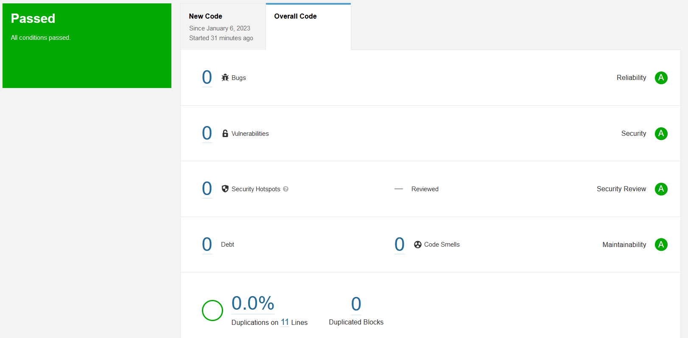

# Домашнее задание к занятию "9.Процессы CI/CD"
## SonarQube
Результат сканирования исправленного кода:  
  
Сам файл можно найти [тут](./SonarQube/fail.py).

## Nexus
Файл [maven-metadata.xml](./nexus/maven-metadata.xml).

## Maven
Исправленный файл [pom.xml](./Maven/pom.xml).